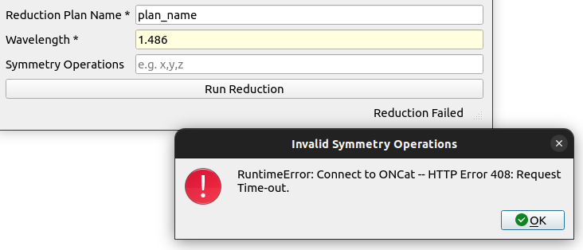

GUI Standards
**************

.. contents:: Table of Contents
   :local:
   :depth: 3

.. _gui_standards:

Validation Strategy
===================

GUI validation is a process aimed at ensuring the accuracy, functionality, and consistency of
the graphical elements within a software application's user interface. It involves systematically
examining and verifying that the graphical components, such as buttons, menus, and screens, behave
as intended and meet specified design standards. Enforcing consistency is a key aspect, ensuring
that the visual elements maintain a uniform appearance and behavior across different parts of
the application, contributing to a cohesive and user-friendly interface.

Effective GUI view validation is crucial for delivering a reliable and user-friendly software
product, ensuring that the visual elements not only meet design specifications but also contribute
to a positive and intuitive user experience. It is often an integral part of the software testing
process, providing assurance that the graphical interface functions seamlessly and enhances the
overall usability of the application.

Helper functions streamline and standardize validation in software development. By encapsulating
validation logic, they ensure consistency, reduce redundancy, and promote code reusability. These
functions simplify maintenance, enhance code readability, and contribute to a modular and scalable
code structure. We plan to create and implement these helper functions to optimize the validation
process in our software development practices.

Validation Items
================

Fields
######

In the user interface all fields will have tooltips with brief information about
the usage of the fields in the workflows.  Additionally, a placeholder text with an
example value can be added in fields the describe complex ideas (e.g. x,y,z). The above
will guide the users seamlessly through the data input process while ensuring clarity and
adherence to form submission requirements.

    Optional Field with tooltip and placeholder text.

Required Fields
################

Required fields will be marked with an asterisk (*) at the end of the label. Required fields
with no default values (text fields) will feature a light yellow background, serving as a widely
adopted convention to visually cue users. This combination of visual indication, through both
asterisks and background color enhances user experience.

    Required Field with asterisk and light yellow background.

    Required Field with default value and tooltip.

Buttons
#######

In Qt applications, a best practice is to disable QPushButton, and similar objects,
when associated required fields are empty or fail validation. This approach prevents
users from attempting form submission with incomplete or incorrect data, promoting a
more user-friendly experience by guiding them to address validation issues before proceeding.
It ensures data integrity and contributes to a smoother interaction flow within the application.

Buttons should also be given meaningful names, such as “Load Experiment Plan” rather than
generic names like “Load”. If multiple buttons exist in the View, it should be clear to the
use which input/output fields correspond to each button. This can be achieved through grouping
fields and clear labels.

    Button with meaningful name and disabled state.

    Button enabled after all fields are valid.

Field Validation
################

Implementing field validation with a red border for invalid entries is a visual cue
that enhances user feedback in interfaces. This approach communicates validation errors
immediately, aiding users in identifying and correcting input issues efficiently. The red
border not only draws attention to the problematic fields but also ensures a clear and
intuitive visual representation of where corrections are needed. Additionally, the status
bar will dynamically change to provide hints on how to rectify the validation errors,
contributing to a more user-friendly and error-tolerant design. The format of the message
will follow this convention:

<field_label1> : <error_message1>

<field_label2> : <error_message2>

Types of Validation
-------------------

Field Validation
++++++++++++++++

Field validation, includes basic checks such as checks for minimum and maximum values or
adherence to specific ranges, ensures data integrity in user input. This validation process
runs as data is entered and enables buttons to become active only when the entered data meets
predefined criteria.

    Field validation with red border and status bar message for one invalid field.

    Field validation with red border and status bar message for two invalid fields.

Algorithm Input Validation
++++++++++++++++++++++++++

Algorithm input validation occurs after enabling and pressing the button.
This type of validation requires more complexity and can include things such as checking
symmetry operations, valid file paths, and workspace existence. These inputs
may include multiple criteria and require more than a cursory check to ensure they meet the
underlying algorithm's requirements. If validation fails, the execution halts, prompting
the user to update the failing values before proceeding.

    Algorithm input validation will occur after the button has been enabled and pressed.

    If an field fails validation after the button has been invoked, a popup will appear to notify
    user and the field will be marked.

    After failing validation, button remains enabled and the fields that failed validation
    will be marked until the button is pressed again.

    After pressing the button, the field will be revalidated and if valid, the field
    will be marked as valid and the algorith will run.

Common Validation Items
-----------------------

Implementing common field validations, such as minimum and maximum values, is essential
for data integrity. To streamline and reduce code redundancy, helper functions will be
created that are dedicated to these types of validation. These functions not only promote
consistency across the codebase but also enhance maintainability, making it easier to manage
and update validation rules consistently throughout the software application.

Error Handling
##############

Error handling involves utilizing both log messages and popups to enhance the debugging
process and user experience. Log messages provide users and developers with detailed
information about errors, warnings, and information for effective debugging. Popups
offer users clear and concise error notifications when a process ends prematurely or
with an error status, guiding users on how to proceed or address the issue. This dual
approach ensures a comprehensive error management system, promoting smoother application
functionality and facilitating efficient issue resolution.

    Error handling with popup explaining the error.
